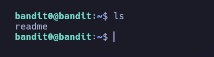

# labs_bandit

> Resolucionde las maquinas bandits de OverTheWire

### Informacion para la Conexion SSH

* Host: bandit.labs.overthewire.org
* port: 2220

Para entablar una conexion se debe realizar el siguiente comando:

``` bash
ssh banditN@bandit.labs.overthewire.org -p 2220 
```

`N` Hace referencia la numero de la maquina `1`,`2`,`3`...`N`

## Bandit-0

La `flag` se encuentra en el direcotrio de trabajo de bandit0 en el archivo de readme con un simple `ls` y `cat` se podra ver el contenido del archivo


